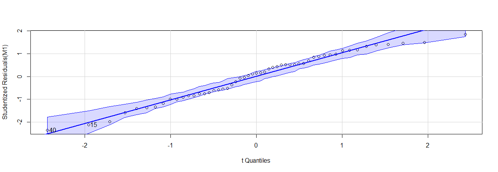
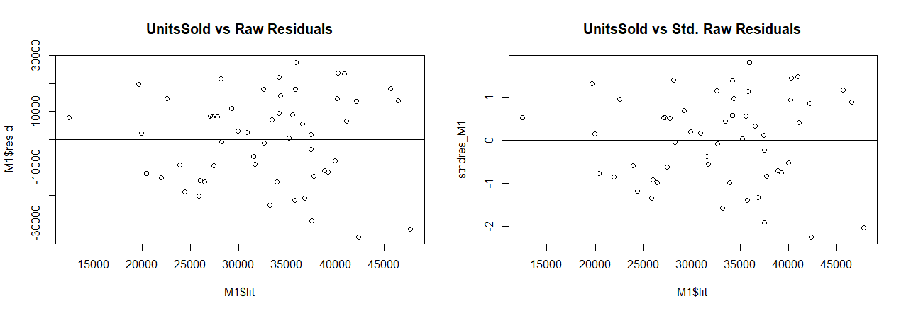
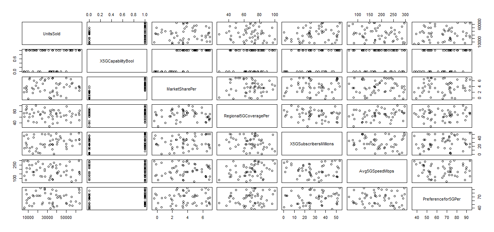

# Regression-Analysis for Sales Forecasting

## Project Overview
This project conducts statistical regression modeling to analyze the influence of multiple 5G-related variables on the number of units sold for Samsung smartphones in North America from 2021 to 2024. The analysis uses R-Studio to evaluate the significance of predictors and assess model assumptions.  

## Objectives
The primary objective is to model the sales performance (Units Sold) of Samsung smartphones based on explanatory variables such as 5G capability, market share, regional coverage, subscriber base, and user preferences. The goal is to identify which features significantly impact sales and how companies can leverage this insight for strategic decision-making.

## Project Structure

### 1. Database Setup

- **Database Description**:
The dataset contains 53 observations and the following key variables:

Response Variable:
UnitsSold (Discrete)

Explanatory Variables:

X5GCapabilityBool (Discrete)

MarketSharePer (Continuous)

Regional5GCoveragePer (Continuous)

X5GSubscribersMillions (Continuous)

Avg5GSpeedMbps (Continuous)

Preferencefor5GPer (Continuous)

- **Model Setup**:
- 
```R
	setwd("A:/Clemson/Spring 2025/STAT 8030/Project")
	Mobile <- read.csv(file="Samsung model sales in North America (0-1).csv")
	Mobile [1,]
  attach(Mobile)
	M1 <- lm(UnitsSold ~ X5GCapabilityBool + MarketSharePer + Regional5GCoveragePer + X5GSubscribersMillions + Avg5GSpeedMbps + Preferencefor5GPer, data = Mobile)
```
- **Checking the normality of data**:

```R
	library(car)
	qqPlot(M1)

```
Output:


Normality Plot


Residual Plot

- **Checking the Multicollinearity**:

```R
	vif_func<-function(in_frame,thresh=10,trace=T,...){
  #library(fmsb)
  VIF <- function(X) { 1/(1-summary(X)$r.squared) }
  percentile <- function(dat) { # convert numeric vector into percentiles
    pt1 <- quantile(dat, probs=seq(0, 1, by=0.01), type=7) # set minimum 0 percentile.
    pt2 <- unique(as.data.frame(pt1), fromLast=TRUE)
    pt3 <- rownames(pt2)
    pt4 <- as.integer(strsplit(pt3, "%"))
    datp <- pt4[as.integer(cut(dat, c(0, pt2$pt1), labels=1:length(pt3)))]
    return(datp)
  }
  if(any(!'data.frame' %in% class(in_frame))) in_frame<-data.frame(in_frame)
  #get initial vif value for all comparisons of variables
  vif_init<-NULL
  var_names <- names(in_frame)
  for(val in var_names){
    regressors <- var_names[-which(var_names == val)]
    form <- paste(regressors, collapse = '+')
    form_in <- formula(paste(val, '~', form))
    vif_init<-rbind(vif_init, c(val, VIF(lm(form_in, data = in_frame, ...))))
  }
  vif_max<-max(as.numeric(vif_init[,2]), na.rm = TRUE)
  if(vif_max < thresh){
    if(trace==T){ #print output of each iteration
      prmatrix(vif_init,collab=c('var','vif'),rowlab=rep('',nrow(vif_init)),quote=F)
      cat('\n')
      cat(paste('All variables have VIF < ', thresh,', max VIF ',round(vif_max,2), sep=''),'\n\n')
    }
    return(var_names)
  }
  else{
    in_dat<-in_fram
    #backwards selection of explanatory variables, stops when all VIF values are below 'thresh'
    while(vif_max >= thresh)
      vif_vals<-NULL
      var_names <- names(in_dat)
      for(val in var_names){
        regressors <- var_names[-which(var_names == val)]
        form <- paste(regressors, collapse = '+')
        form_in <- formula(paste(val, '~', form))
        vif_add<-VIF(lm(form_in, data = in_dat, ...))
        vif_vals<-rbind(vif_vals,c(val,vif_add))
      }
      max_row<-which(vif_vals[,2] == max(as.numeric(vif_vals[,2]), na.rm = TRUE))[1]
      vif_max<-as.numeric(vif_vals[max_row,2])
      if(vif_max<thresh) break
      if(trace==T){ #print output of each iteration prmatrix(vif_vals,collab=c('var','vif'),rowlab=rep('',nrow(vif_vals)),quote=F)
        cat('\n')
        cat('removed: ',vif_vals[max_row,1],vif_max,'\n\n')
        flush.console()
      } 
      in_dat<-in_dat[,!names(in_dat) %in% vif_vals[max_row,1]]  
    }   
    return(names(in_dat))  
  }
}
	m <- Mobile[,-(1:4)]
	round(cor(m[,c(2,1,4:8)]),2)

```  
Output:



```R
	vif(M1)
X5GCapabilityBool      MarketSharePer  Regional5GCoveragePer X5GSubscribersMillions         

2.838115               2.509538               1.211113               1.168005               

Avg5GSpeedMbps     Preferencefor5GPer 

1.102620               1.126178 
```
